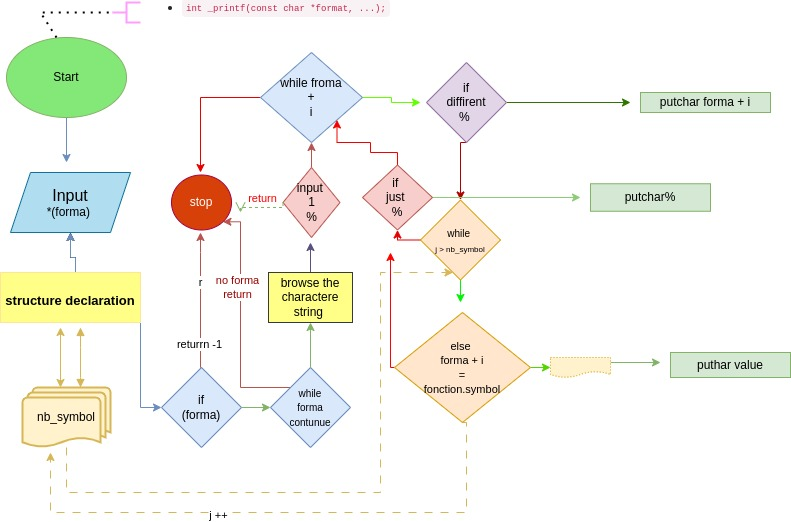

# We write our own _printf()

# What does _printf() do ?
This repository presents a _printf() function that we created inspired by the printf() function. it will print output.

## I - Compilation
All files will be compiled with gcc 9.4.0 using the flags : -Wall -Werror -Wextra -pedantic

```
gcc -Wall -Werror -Wextra -pedantic *.c -std=gnu89 -Wno-format *.c
```
## II - Description

### a. Betty style

All files are written in C and follows the Betty coding style for Holberton School. For more detail, check this page:
[Betty style documentation](https://github.com/holbertonschool/Betty/wiki)

##
###  b. Standard functions used

-   write (man 2 write)
-   malloc (man 3 malloc)
-   free (man 3 free)
-   va_start (man 3 va_start)
-   va_end (man 3 va_end)
-   va_copy (man 3 va_copy)
-   va_arg (man 3 va_arg)
-   _putchar(char c)

##
###  c. Prototype functions used

All function prototypes used to compile _printf() are included in the header file **main.h**:

-  __int _putchar(char c);__
- __int _print_char(va_list arg);__
- __int _print_string(va_list arg);__
- __int _print_int(va_list arg);__
- __int _printf(const char *format, ...);__


##
### d.  File description

- __main.h__ --->  possesses all prototypes and a structure
- ___printf.c__ ---> possesses the function _printf()
- ___print_int.c__ ---> combines two function who prints decimal and integer
- ___print_char__ ---> possesses the function _print_char()
- ___print_string__ ---> possesses the function _print_string()


##
###  e. Function description
***an example of what _printf() will do :***

- __int _printf(const char *format, ...)__

```main.c```:

```
#include "main.h"

int main(void)
{
    _printf("Let's try to printf a simple sentence./n");
        _printf("String:[%s]\n", "I am a string !");

    return (0);
    }

```

Compilation :

```
gcc -Wall -Werror -Wextra -pedantic *.c -std=gnu89 -Wno-format *.c -o test
```

Output :

```
$ ./test
Let's try to printf a simple sentence.
String:[I am a string !]
$
```
Here are the  specifiers that we can use in the _printf()  and compare with the charactere after '%'

| speciefers   |  Functions     |
| :-----------:|---------------:|
| c            | _print_char    |
| s            | _print_string  |
| d            | _print_int     |
| i            | _print_int     |

##
### f. Flowchart



### Authors:
##
Lecuyer Gaetan
Pourias Marc
Abdou Chaherdine